# Darrell Wang · 王仁宗

**Martech & Automation Engineer · Taipei, Taiwan**

---

### ⎯⎯ system status ⎯⎯

| 🔁 n8n workflows | 🧩 Claude Code skills | 🔌 APIs integrated | 🌏 regions led |
|:---:|:---:|:---:|:---:|
| **500+** | **67** | **35+** | **TW · HK · CN** |

---

## ⚙️ What I actually do

<table>
<tr>
<td width="50%" valign="top">

### 📡 Measurement
GA4 · GTM · server-side GTM · Measurement Protocol · BigQuery · Looker Studio

Tracking that holds up when someone audits the numbers.

</td>
<td width="50%" valign="top">

### 🔁 Automation
n8n · Python · Apps Script · Cloud Functions · Cloudflare Workers · GitHub Actions

500+ workflows in my own instance. The largest is 150 nodes.

</td>
</tr>
<tr>
<td width="50%" valign="top">

### 🧠 AI agents
LangChain agents · structured output · RAG · MCP servers · Claude / GPT / Gemini / Grok

Models wired into real systems, not a chat window.

</td>
<td width="50%" valign="top">

### 🎓 Teaching
Threads 13k+ · long-form blog · Vibe Coding workshops

I ship it, then I teach the team to keep it running.

</td>
</tr>
</table>

---

## 📈 Selected work

| client | problem | what I shipped |
| --- | --- | --- |
| **Digital publishing** | Tracking numbers nobody could explain | Forensics across 269K log rows, Measurement Protocol reproduction, fix that held |
| **Property finance** | Registry documents parsed by hand | LINE intake → OCR → Drive filing → approval sheet, iterated to production |
| **Travel agency** | Four platforms, four manual exports | GA4 + Search Console + Meta + Airtable → Sheets → Looker Studio, on a schedule |
| **Beauty brand** | No view of brand or competitor chatter | Listening across 59 YouTube channels, Dcard and FB groups, AI-scored, LINE digest daily |
| **Online travel agency** | GA4 quietly drifting | Monthly measurement retainer |

---

## 🧰 Stack

---

## 📦 Open source

<table>
<tr>
<td width="50%" valign="top">

**[darrelltw-mods](https://github.com/darrell-tw/darrelltw-mods)** ⭐
Claude Code mods that draw above the prompt and spend zero model tokens.

**[claudecode-statusline](https://github.com/darrell-tw/claudecode-statusline)** ⭐
Claude Code Statusline snippets, including a 2x promotion indicator.

**[busytag-llm-meter](https://github.com/darrell-tw/busytag-llm-meter)**
Claude Code and Codex rate limits, live on a USB desk light.

</td>
<td width="50%" valign="top">

**[darrell-shopline-line-report](https://github.com/darrell-tw/darrell-shopline-line-report)**
SHOPLINE + GA4 + Search Console weekly report as a LINE Flex carousel.

**[elevenlabs-tts-demo](https://github.com/darrell-tw/elevenlabs-tts-demo)**
Typed TTS client with retry, async batching, bilingual CLI.

**[screenshot-ai-renamer](https://github.com/darrell-tw/screenshot-ai-renamer)**
Renames screenshots from what is actually in the image.

</td>
</tr>
</table>

---

### Got something that should run itself?

